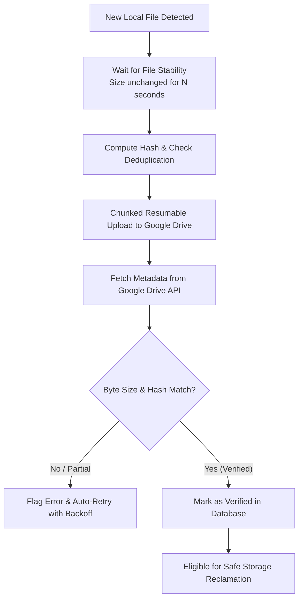

# 🛡️ DriveVault — Google Drive Desktop Auto-Backup & Storage Manager

<div align="center">


[](https://github.com/)
[](https://nextjs.org/)
[](https://www.electronjs.org/)
[](https://www.typescriptlang.org/)
[](https://tailwindcss.com/)
[](https://developers.google.com/drive)
[](https://microsoft.com/windows)
[](LICENSE)

**Secure, high-speed, 24/7 background desktop auto-backup for your gaming clips (Medal, OBS, ShadowPlay), project files, and local folders to your personal Google Drive with byte-accurate verification and zero FPS drops.**

[Features](#-key-features) • [Installation & Setup](#-installation--quick-start) • [Google Cloud OAuth Guide](#-google-cloud-oauth-20-setup-step-by-step) • [Architecture](#-architecture--stack) • [Building from Source](#-building-installers-from-source) • [Safety Guarantee](#-zero-loss-safety-guarantee)

</div>

---

## 📖 Overview / Project परिचय

**DriveVault** is an intelligent desktop application engineered to eliminate local storage anxiety. It automatically watches your specified folders (e.g. Medal clips, OBS recordings, Downloads, Documents), detects when new files are finished writing, securely uploads them in resumable chunks directly to your own Google Drive, verifies file integrity against Google servers, and allows safe local cleanup.

> 🇮🇳 **हिंदी विवरण**: DriveVault आपके PC के क्लिप्स और फ़ोल्डर्स को 24/7 बैकग्राउंड में बिना गेम लैग किए आपके पर्सनल Google Drive पर ऑटो-अपलोड करता है। फ़ाइल पूरी तरह Google Drive पर सेफ़ अपलोड और वेरीफ़ाई होने के बाद ही लोकल डिस्क स्पेस ख़ाली करने का सुरक्षित विकल्प देता है।

---

## ✨ Key Features

| Feature | Description |
| :--- | :--- |
| 🚀 **Resumable Chunked Uploader** | Uploads massive 4K/60FPS video files in 256KB–10MB adaptive chunks with automatic session resume on network drops. |
| 🛡️ **Zero-Loss Safety Engine** | Local files are **never** deleted when an upload starts. Verification confirms exact byte length and MD5 checksum before cleanup. |
| 🎮 **Gaming Mode (Zero FPS Drop)** | Auto-detects running games (Valorant, CS2, Fortnite, Apex, GTA V, etc.) and throttles sync to prevent ping spikes or frame drops. |
| 🌐 **Live Speedometer & Telemetry** | Real-time network speed gauge, ping latency test, ISP bandwidth graphs, and configurable upload speed caps. |
| 📂 **Folder Hierarchy Preservation** | Automatically mirrors your local subfolder structures directly into your Google Drive root or dedicated vault folders. |
| 🔒 **Military-Grade Token Vault** | Google OAuth tokens are sealed at rest with **AES-256-GCM** encryption using local 0600 machine keys. Zero token leakage in logs. |
| 🔔 **System Tray & 24/7 Daemon** | Runs silently in the background, starts automatically on Windows boot, and minimizes to the system tray. |
| 🪄 **Onboarding Setup Wizard** | 3-step interactive setup wizard that automatically auto-detects Medal, GeForce ShadowPlay, and OBS capture folders. |
| ⌨️ **Universal Command Palette** | Press `Ctrl + K` anywhere for lightning-fast keyboard navigation, search, and instant commands. |
| 🌓 **Glassmorphism Dark UI** | Sleek, futuristic glassmorphism interface powered by Tailwind CSS, Lucide icons, and Framer Motion micro-animations. |

---

## 🛡️ Zero-Loss Safety Guarantee



1. **Stability Detection**: Watches file handles until games/OBS finish rendering the video file.
2. **Duplicate Prevention**: Path + Size + Modification Time + Hash cache skips re-uploading existing files.
3. **Double Verification**: DriveVault verifies the remote Google Drive file before anything is marked eligible for disk cleanup.
4. **Global Kill-Switch**: One-click emergency freeze in Settings pauses all uploads and file operations immediately.

---

## 🚀 Installation & Quick Start

### Option 1: Native Windows Desktop Executable (Recommended)

1. Download the latest release from the [Releases](https://github.com/) section:
   - **`DriveVault-Setup-1.0.0.exe`**: Full Windows NSIS Installer (Desktop icon, Start menu, Auto-updater).
   - **`DriveVault-Portable-1.0.0.exe`**: Standalone portable single-file executable (no installation required).
2. Run the application.
3. Complete the 60-second **Setup Wizard** to connect your Google Drive and select your clip/backup folders!

#### 💡 1-Click PowerShell Setup (Auto-Start + Native Launcher)
If you cloned this repository, you can configure 24/7 background startup with:
```powershell
.\Install-Desktop-App.ps1
```
Or launch immediately with:
```cmd
DriveVault.bat
```

---

### Option 2: Developer / Local Hosted Setup

#### Prerequisites
- **Node.js**: v18.0.0 or higher ([Download Node.js](https://nodejs.org/))
- **npm** or **pnpm** / **yarn**

#### 1. Clone & Install Dependencies
```bash
git clone https://github.com/<your-username>/drivevault.git
cd drivevault
npm install
```

#### 2. Configure Environment Variables
Copy `.env.example` to `.env`:
```bash
cp .env.example .env
```
Fill in your Google OAuth Client ID and Secret (see guide below):
```env
GOOGLE_CLIENT_ID=your_client_id.apps.googleusercontent.com
GOOGLE_CLIENT_SECRET=your_client_secret
```

#### 3. Run Development Server
```bash
npm run dev
```
Open [http://localhost:3000](http://localhost:3000) in your browser.

#### 4. Run Desktop Electron Runtime
```bash
npm run electron:dev
```

---

## 🔑 Google Cloud OAuth 2.0 Setup (Step-by-Step)

To let DriveVault securely upload files to *your* personal Google Drive account:

```
┌────────────────────────────────────────────────────────────────────────┐
│ 1. Open Google Cloud Console: https://console.cloud.google.com/        │
│ 2. Click "Select a project" -> "New Project" -> Name it "DriveVault"  │
│ 3. Go to "APIs & Services" -> "Library" -> Search "Google Drive API"  │
│    -> Click "Enable"                                                   │
│ 4. Go to "APIs & Services" -> "OAuth consent screen"                   │
│    - User Type: External                                               │
│    - App Name: DriveVault                                              │
│    - User Support Email: Your Gmail                                    │
│    - Test Users: Add your personal Gmail address                       │
│ 5. Go to "APIs & Services" -> "Credentials" -> "Create Credentials"   │
│    -> "OAuth client ID"                                                │
│    - Application Type: Web application                                 │
│    - Name: DriveVault Client                                           │
│    - Authorized Redirect URIs:                                         │
│        • http://localhost:3000/api/auth/callback                      │
│        • http://127.0.0.1:42813/callback (for Desktop Electron app)    │
│ 6. Copy "Client ID" and "Client Secret" into your .env or the in-app  │
│    Setup Wizard!                                                       │
└────────────────────────────────────────────────────────────────────────┘
```

---

## 🏗️ Architecture & Stack

```
build-drivevault-desktop-app/
├── src/                          # Next.js App Router (UI & Core APIs)
│   ├── app/                      # Dashboard, Drive Files, Queue, Settings, Storage
│   │   ├── api/                  # API routes (auth, queue, engine, fs, health, logs)
│   │   ├── page.tsx              # Holographic Command Dashboard
│   │   └── globals.css           # Custom Glassmorphism design tokens & animations
│   ├── components/               # React 19 UI Component Suite
│   │   ├── AppShell.tsx          # Navigation, Topbar, Hotkeys, Status indicator
│   │   ├── CommandPalette.tsx    # Ctrl + K Universal action bar
│   │   ├── DriveFilesPanel.tsx   # Google Drive File Browser & Preview
│   │   ├── NetworkSpeedometerModal.tsx # Live bandwidth & speed test gauge
│   │   ├── PCExplorerModal.tsx   # Local file system picker
│   │   ├── SetupWizard.tsx       # 3-Step First-Launch Wizard
│   │   └── StorageInsightsCard.tsx # Visual disk & cloud quota meters
│   └── lib/                      # Safety-critical core engine
│       ├── engine.ts             # Folder watcher & sync coordinator
│       ├── uploader.ts           # Resumable chunked Google Drive uploader
│       ├── safety.ts             # Verify-before-delete rules & kill switch
│       ├── dedupe.ts             # Hash-based duplicate detection
│       ├── google.ts             # Google OAuth2 & Drive API client
│       └── crypto.ts             # AES-256-GCM token encryption
├── desktop/                      # Native Electron Desktop Wrapper
│   ├── src/main/                 # Electron main process, IPC handlers, SQLite
│   └── package.json              # Electron build configuration
├── dist-installer/               # Built Windows Executable Installers (.exe)
├── tests/                        # Automated unit test suite
├── DriveVaultLauncher.cs         # C# Win32 Native Launcher with Icon & Low CPU Priority
├── Install-Desktop-App.ps1       # 1-Click Windows 24/7 Desktop Installer
└── package.json                  # Root configuration & scripts
```

---

## 📦 Building Installers from Source

To package DriveVault into standalone Windows executables (`.exe`):

```bash
# Build production bundle and package NSIS installer + Portable EXE
npm run dist

# Or package portable directory only
npm run dist:portable
```

The output executables will be generated in `dist-installer/`:
- `DriveVault-Setup-1.0.0.exe` (Windows NSIS Setup Installer)
- `DriveVault-Portable-1.0.0.exe` (Zero-install portable single executable)

---

## 🧪 Running Automated Tests

DriveVault includes automated unit tests covering safety rules, uploader reliability, deduplication, and queue persistence:

```bash
node --import tsx --test tests/*.test.ts
```

- ✅ `tests/safety.test.ts` — Deletion protection, remote verification before unlink, kill switch.
- ✅ `tests/dedupe.test.ts` — SHA-256 hashing, size comparison, exponential backoff.
- ✅ `tests/file-watcher.test.ts` — Video stability detection, lock release detection.
- ✅ `tests/upload-reliability.test.ts` — Chunk resume offsets, network fault handling.
- ✅ `tests/queue-persistence.test.ts` — SQLite / DB queue persistence across reboots.

---

## ⚙️ Configuration Reference (`.env`)

| Variable | Required | Description | Default |
| :--- | :--- | :--- | :--- |
| `GOOGLE_CLIENT_ID` | **Yes** | OAuth 2.0 Client ID from Google Cloud Console | `""` |
| `GOOGLE_CLIENT_SECRET` | **Yes** | OAuth 2.0 Client Secret from Google Cloud Console | `""` |
| `DATABASE_URL` | Optional | PostgreSQL connection string (Hosted mode only) | `postgresql://...` |
| `DRIVEVAULT_VAULT_KEY` | Optional | 32-byte hex key for token encryption | Auto-generated in `.vault/` |
| `PORT` | Optional | Port for local web server | `3000` |

---

## ❓ Frequently Asked Questions (FAQ)

<details>
<summary><b>Q: Will DriveVault delete my local recordings automatically?</b></summary>
<br/>
<b>No!</b> By default, DriveVault only uploads and verifies files. Auto-cleanup is an optional toggle in Settings that requires double confirmation. Even when enabled, a local file is <b>NEVER</b> deleted unless DriveVault connects back to Google Drive and confirms the exact byte length and hash match 100%.
</details>

<details>
<summary><b>Q: Does this work with Medal.tv, OBS, and GeForce ShadowPlay?</b></summary>
<br/>
<b>Yes!</b> DriveVault includes pre-configured auto-detection for Medal (`~/Videos/Medal`), OBS (`~/Videos`), and GeForce Experience (`~/Videos/Captures`) folders.
</details>

<details>
<summary><b>Q: Will my games lag while DriveVault uploads in the background?</b></summary>
<br/>
<b>No!</b> DriveVault includes Gaming Mode telemetry. When a game process is detected, upload bandwidth is throttled and CPU priority is kept at <code>BelowNormal</code> so your FPS and ping remain unaffected.
</details>

<details>
<summary><b>Q: Are my files uploaded to any third-party server?</b></summary>
<br/>
<b>No!</b> All network traffic goes directly between your computer and Google Drive's official API servers (<code>www.googleapis.com</code>). No third-party servers, proxies, or analytics collect your files.
</details>

---

## 📄 License

This project is licensed under the [MIT License](LICENSE) — feel free to use, modify, and distribute for personal and commercial projects.

---

<div align="center">
Made with ❤️ for gamers, creators, and developers who value their files and disk space.
<br/>
<b>DriveVault — Your PC is Protected.</b>
</div>
